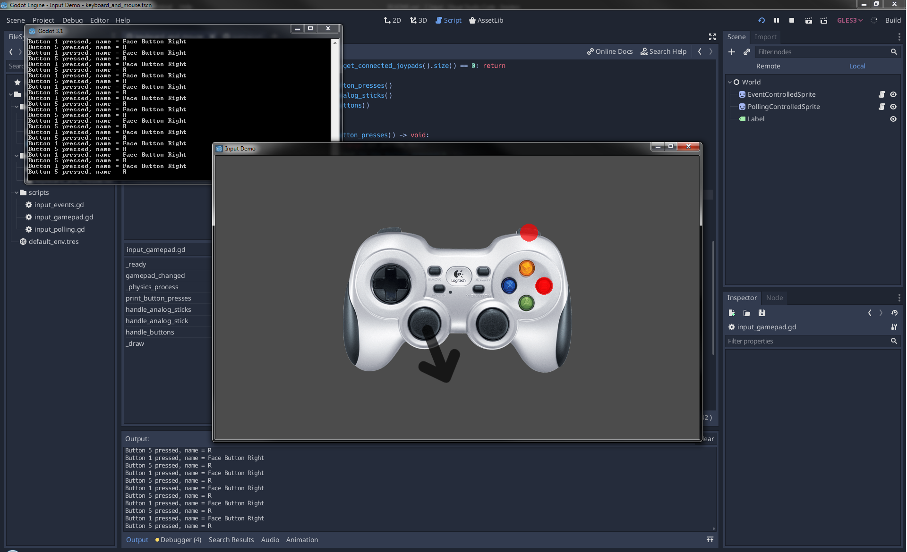

# Working with input demo
A demo that handles keyboard, mouse, touch, and gamepad input using both polling and event-driven techniques.

Gamepad is the [Logitech F710](https://www.logitechg.com/en-us/products/gamepads/f710-wireless-gamepad.html)

## References
* https://www.youtube.com/watch?v=7r7ZPmspDew&list=PLS9MbmO_ssyDk79j9ewONxV88fD5e_o5d&index=6
* Mouse and touch events:
  * https://docs.godotengine.org/en/3.1/tutorials/inputs/inputevent.html
  * https://docs.godotengine.org/en/3.1/classes/class_inputeventmousemotion.html
  * https://docs.godotengine.org/en/3.1/classes/class_inputeventmousebutton.html
  * https://docs.godotengine.org/en/3.1/classes/class_inputeventscreentouch.html
  * https://docs.godotengine.org/en/3.1/classes/class_inputeventscreendrag.html
  * https://godotengine.org/qa/21730/how-to-detect-swipe-and-multitouch
