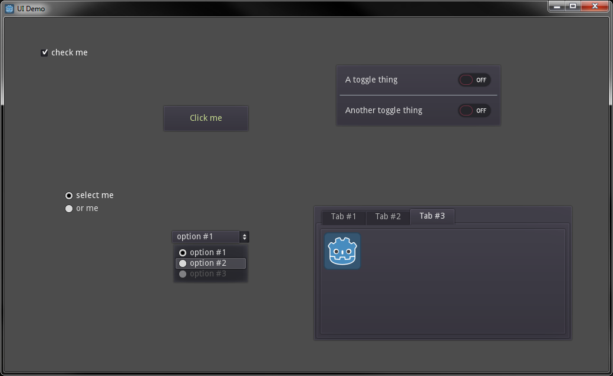

# User interface demo
A demo of various UI elements in Godot:
* Button
* Checkbox
* Radio button
* Dropdown (OptionButton)
* Toggle (CheckButton)
* Containers, layout
* Tabs
* Popups/modals
* Themes

## References
* https://www.youtube.com/watch?v=RmKcFk2LQjM&list=PLS9MbmO_ssyDk79j9ewONxV88fD5e_o5d&index=7
