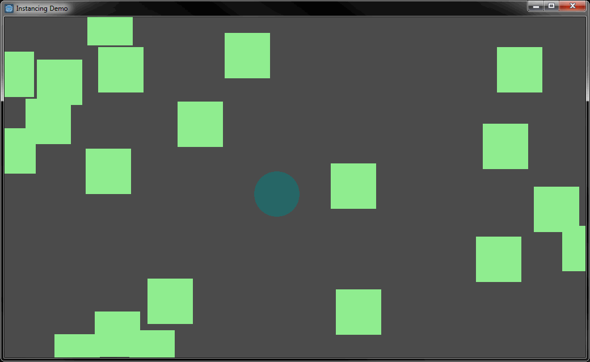

# Instancing and area-based 2D collision detection demo
A demo of loading scenes at runtime and detecting collisions using Area2D:

## References
* https://docs.godotengine.org/en/3.1/getting_started/step_by_step/instancing.html
* https://docs.godotengine.org/en/3.1/getting_started/step_by_step/scripting_continued.html#instancing-scenes
* https://www.youtube.com/watch?v=vY4I5VeQbBk&list=PLS9MbmO_ssyDk79j9ewONxV88fD5e_o5d&index=9
