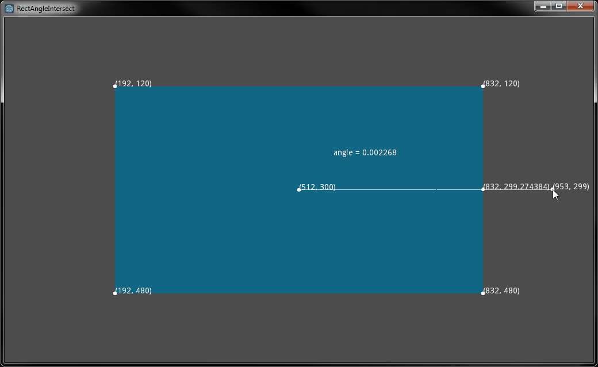

# Finding the point on a rectangle at a given angle
A solution to a particular sub-problem I had while working on [PlanetaryDefense](../Games/PlanetaryDefense): what is the point on a rectangle that a line drawn from a given angle will intersect?

## References
* https://stackoverflow.com/questions/4061576/finding-points-on-a-rectangle-at-a-given-angle
* https://stackoverflow.com/questions/1585525/how-to-find-the-intersection-point-between-a-line-and-a-rectangle (for a line instead of an angle)
